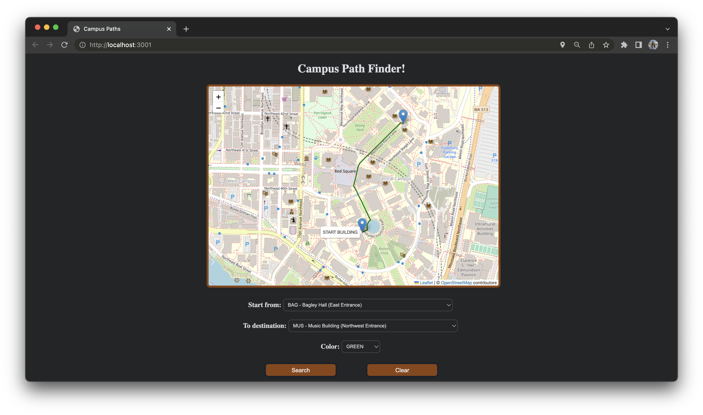

# Leah Jia's Projects

[![LinkedIn][linkedin-shield]][linkedin-url]
[![Personal][personal-shield]][personal-url]


<!-- PROJECT LOGO -->
<br />
<div align="center">
  <a href="https://github.com/leahjia/Projects">
    
  </a>

  <h3 align="center">Campus Path Finder</h3>

  <p align="center">
    The quickest way to find available routes on campus!
  </p>
</div>

<!-- ABOUT THE PROJECT -->
## About The Project
* Path Finder is a client-server application to allow you to search for the shortest routes on UW campus 🏫
* It uses the modeling of map data structure and API endpoints to allow frontend connection to backend 💻
* It increases data sorting and retrieval speed by 70% by incorporating Dijkstra’s algorithm ✔️
* It also ensures high complexity and functionality of the application with Jest, JUnit, and script tests that runs in the back end 🥇


### Built With

* [![React][React.js]][React-url]
* [![Bootstrap][Bootstrap.com]][Bootstrap-url]

### Prerequisites
* npm
  ```sh
  npm install npm@latest -g
  ```


<!-- PROJECT LOGO -->
<br />
<div align="center">
  <a href="https://github.com/leahjia/Projects">
    
  </a>

  <h3 align="center">Dawg Date</h3>

  <p align="center">
    A better dating experience on campus for University of Washington students!
  </p>
</div>

<!-- ABOUT THE PROJECT -->
## About The Project
* DawgDate provides a secure platform exclusively for University of Washington students to safely meet each other.
* It is a platform that focuses on you. 
* Save time and find others based on your own preferences 💌


### Built With

* [![React][React.js]][React-url]
* [![Bootstrap][Bootstrap.com]][Bootstrap-url]

### Prerequisites
* npm
  ```sh
  npm install npm@latest -g
  ```

<!-- CONTACT -->
## Contact

Leah Jia - [@leahjia](https://www.linkedin.com/in/leahjia/) - yuwenj3@uw.edu

Project Link: [https://dawgdate-info340-project.web.app/](https://dawgdate-info340-project.web.app/)


<!-- ACKNOWLEDGMENTS -->
## Acknowledgments
* [Choose an Open Source License](https://choosealicense.com)
* [GitHub Emoji Cheat Sheet](https://www.webpagefx.com/tools/emoji-cheat-sheet)
* [Img Shields](https://shields.io)
* [GitHub Pages](https://pages.github.com)
* [Font Awesome](https://fontawesome.com)
* [React Icons](https://react-icons.github.io/react-icons/search)


<!-- MARKDOWN LINKS & IMAGES -->
<!-- https://www.markdownguide.org/basic-syntax/#reference-style-links -->
[personal-shield]: https://img.shields.io/badge/Leah-Jia-blue?style=for-the-badge
[personal-url]: https://leah--jia.web.app/
[linkedin-shield]: https://img.shields.io/badge/-LinkedIn-black.svg?style=for-the-badge&logo=linkedin&colorB=555
[linkedin-url]: https://linkedin.com/in/leahjia/
[React.js]: https://img.shields.io/badge/React-20232A?style=for-the-badge&logo=react&logoColor=61DAFB
[React-url]: https://reactjs.org/
[Bootstrap.com]: https://img.shields.io/badge/Bootstrap-563D7C?style=for-the-badge&logo=bootstrap&logoColor=white
[Bootstrap-url]: https://getbootstrap.com
