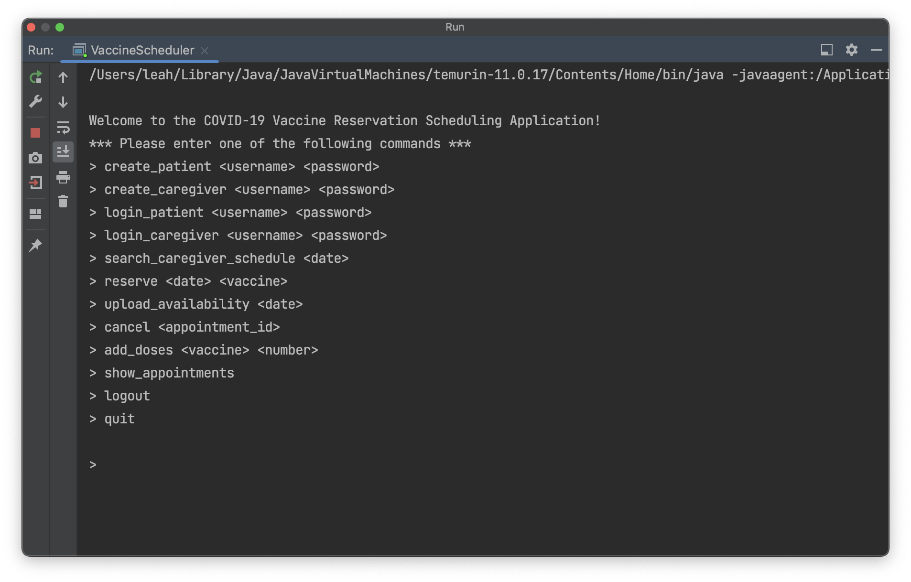

# DB-System-Design

[![LinkedIn][linkedin-shield]][linkedin-url]
[![Personal][personal-shield]][personal-url]

<!-- PROJECT LOGO -->
 

  

  <h3 align="center">Appointment Reservation System</h3>

  

    Goal: Make Reservation Process Simpler
  

<!-- ABOUT THE PROJECT -->
## About The Design
* This DB system is scheduling application that takes in user information and lets you interactively schedule appointments using command-line interface as UI 🏥
* It uses SQL queries within Java to create relational databases and send to Azure via JDBC drivers 💻
* It enforced data security by encrypting sensitive data before storing it in the cloud-based environment ✔️
* It also optimizes queries to retrieve data with low latency (<800ms) and error rate (<0.02%), reduced query time from 600.03 seconds to 0.77 seconds using dataverse, saving you minutes of wait time 🏃‍♂️

### Built With
[![Azure][Azure-shield]][Azure-url]

<!-- CONTACT -->
## Contact / Feedback

Email: yuwenj3@uw.edu

Personal Web - [leahjia.com](https://leahjia.com/)

LinkedIn - [@leahjia](https://www.linkedin.com/in/leahjia/)

<!-- ACKNOWLEDGMENTS -->
## Acknowledgments
* [Img Shields](https://shields.io)
* [GitHub Pages](https://pages.github.com)
* [React Icons](https://react-icons.github.io/react-icons/search)

(<a href="#readme-top">back to top</a>)

<!-- MARKDOWN LINKS & IMAGES -->
<!-- https://www.markdownguide.org/basic-syntax/#reference-style-links -->
[linkedin-shield]: https://img.shields.io/badge/-LinkedIn-black.svg?style=for-the-badge&logo=linkedin&colorB=666
[linkedin-url]: https://linkedin.com/in/leahjia/
[personal-shield]: https://img.shields.io/badge/Leah-Jia-blue?style=for-the-badge
[personal-url]: https://leahjia.com/
[Azure-shield]: https://img.shields.io/badge/-Azure-blue?style=for-the-badge&logo=Azure&logoColor=white
[Azure-url]: https://azure.microsoft.com/en-us
